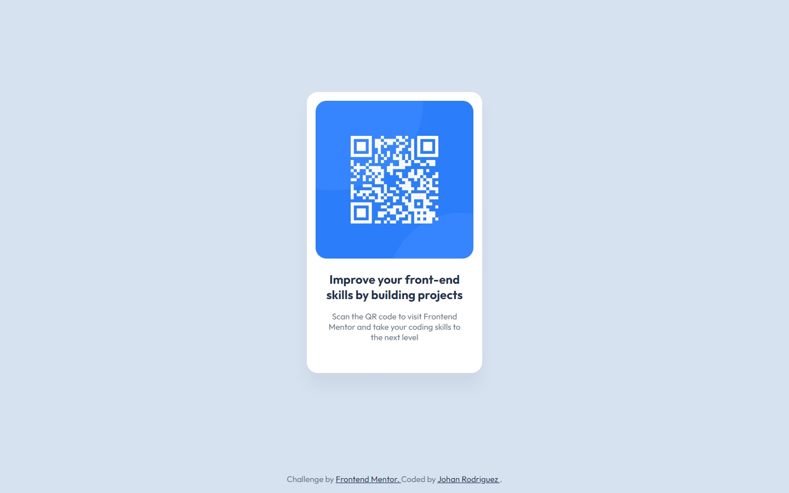

# Frontend Mentor - QR code component solution

This is a solution to the [QR code component challenge on Frontend Mentor](https://www.frontendmentor.io/challenges/qr-code-component-iux_sIO_H). Frontend Mentor challenges help you improve your coding skills by building realistic projects.

## Table of contents

- [Frontend Mentor - QR code component solution](#frontend-mentor---qr-code-component-solution)
  - [Overview](#overview)
    - [Screenshot](#screenshot)
    - [Links](#links)
  - [My process](#my-process)
    - [Built with](#built-with)
    - [Continued development](#continued-development)
    - [Useful resources](#useful-resources)
  - [Author](#author)
  - [Acknowledgments](#acknowledgments)

## Overview

### Screenshot

### Links

- [Solution URL]()
- [Live Site URL](https://jdrodriguez2707.github.io/qr-code-component/)

## My process

### Built with

- Semantic HTML5 markup
- CSS custom properties
- CSS Grid
- [Google fonts](https://fonts.google.com/) - Font library

### Continued development

- I want to continue learning about Figma and how to work with professional workflows and design tools.

### Useful resources

- [Nu HTML Checker](https://validator.w3.org/nu/) - This helped me to validate my HTML code and make sure it was correct with the W3C standards.

## Author

- Frontend Mentor - [@jdrodriguez2707](https://www.frontendmentor.io/profile/jdrodriguez2707)
- X - [@Johan79854000](https://twitter.com/Johan79854000)
- LinkedIn - [Johan Rodriguez](https://www.linkedin.com/in/jdrodriguez2707/)
- Instagram - [@johan_rodriguez_dev](https://www.instagram.com/johan_rodriguez_dev)

## Acknowledgments

I want to thank Frontend Mentor for providing this challenge, especially for the free+ challenges that allow me to practice with professional tools like Figma. It's been a great experience to learn from these challenges and I'm excited to continue learning and improving my skills.🚀
